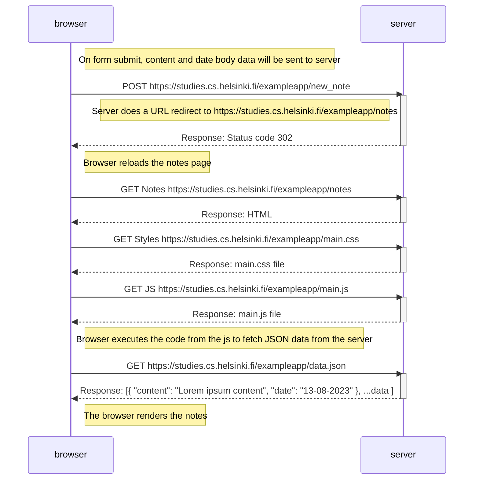

```mermaid

sequenceDiagram
    participant browser
    participant server

    Note right of browser: On form submit, content and date body data will be sent to server
    browser->>server: POST https://studies.cs.helsinki.fi/exampleapp/new_note
    activate server
    Note left of server: Server does a URL redirect to https://studies.cs.helsinki.fi/exampleapp/notes
    server -->>browser: Response: Status code 302
    deactivate server
    Note right of browser: Browser reloads the notes page

    browser->>server: GET Notes https://studies.cs.helsinki.fi/exampleapp/notes
    activate server
    server-->>browser: Response: HTML
    deactivate server

    browser->>server: GET Styles https://studies.cs.helsinki.fi/exampleapp/main.css
    activate server
    server-->>browser: Response: main.css file
    deactivate server

    browser->>server: GET JS https://studies.cs.helsinki.fi/exampleapp/main.js
    activate server
    server-->>browser: Response: main.js file
    deactivate server

    Note right of browser: Browser executes the code from the js to fetch JSON data from the server

    browser->>server: GET https://studies.cs.helsinki.fi/exampleapp/data.json
    activate server
    server-->>browser: Response: [{ "content": "Lorem ipsum content", "date": "13-08-2023" }, ...data ]
    deactivate server

    Note right of browser: The browser renders the notes
```
