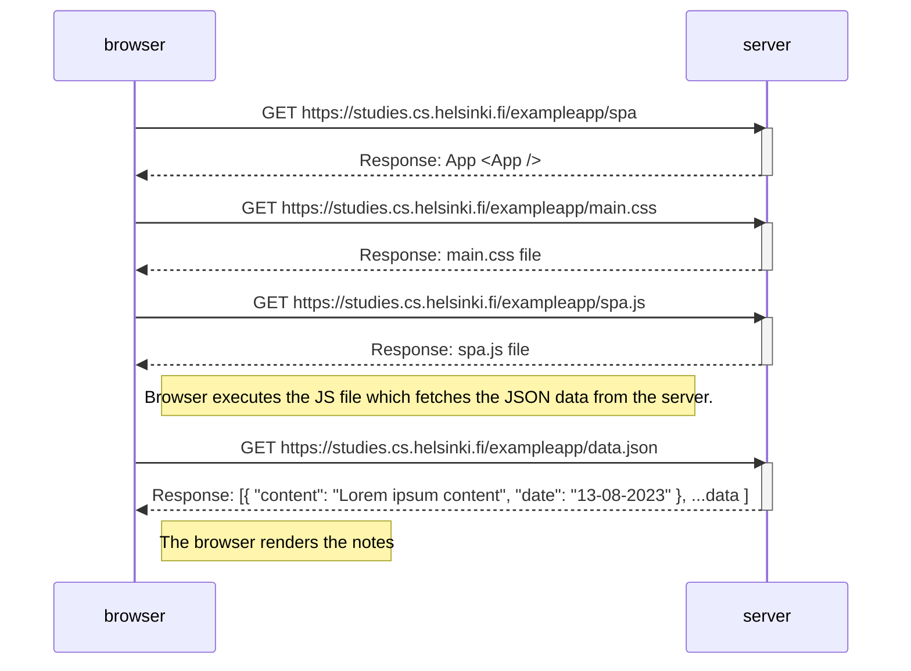

```mermaid

sequenceDiagram
    participant browser
    participant server

    browser->>server: GET  https://studies.cs.helsinki.fi/exampleapp/spa
    activate server
    server-->>browser: Response: App <App />
    deactivate server

    browser->>server: GET https://studies.cs.helsinki.fi/exampleapp/main.css
    activate server
    server-->>browser: Response: main.css file
    deactivate server

    browser->>server: GET https://studies.cs.helsinki.fi/exampleapp/spa.js
    activate server
    server-->>browser: Response: spa.js file
    deactivate server

    Note right of browser: Browser executes the JS file which fetches the JSON data from the server.

    browser->>server: GET https://studies.cs.helsinki.fi/exampleapp/data.json
    activate server
    server-->>browser: Response: [{ "content": "Lorem ipsum content", "date": "13-08-2023" }, ...data ]
    deactivate server

    Note right of browser: The browser renders the notes
```
